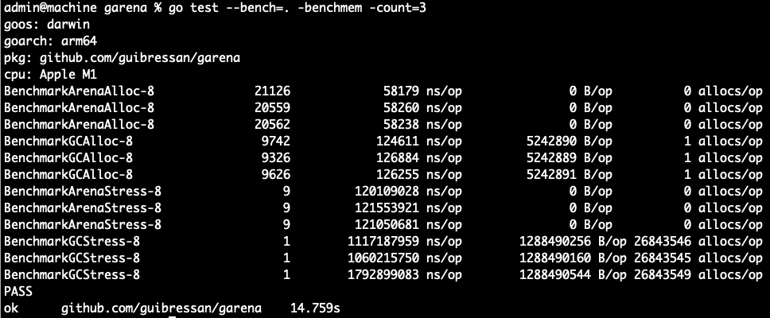
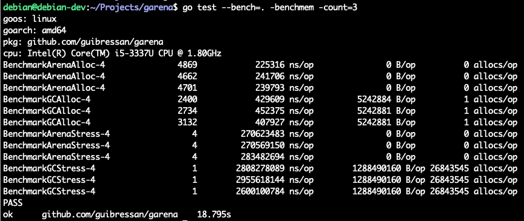

# garena: simple and experimental arena allocator for Go
---

## Some Benchmarks 

* Bench 1 (single allocation speed) -> at least 77% faster than GC alloc
* Bench 2 (multiple allocation speed) -> at least 770% faster than GC alloc
